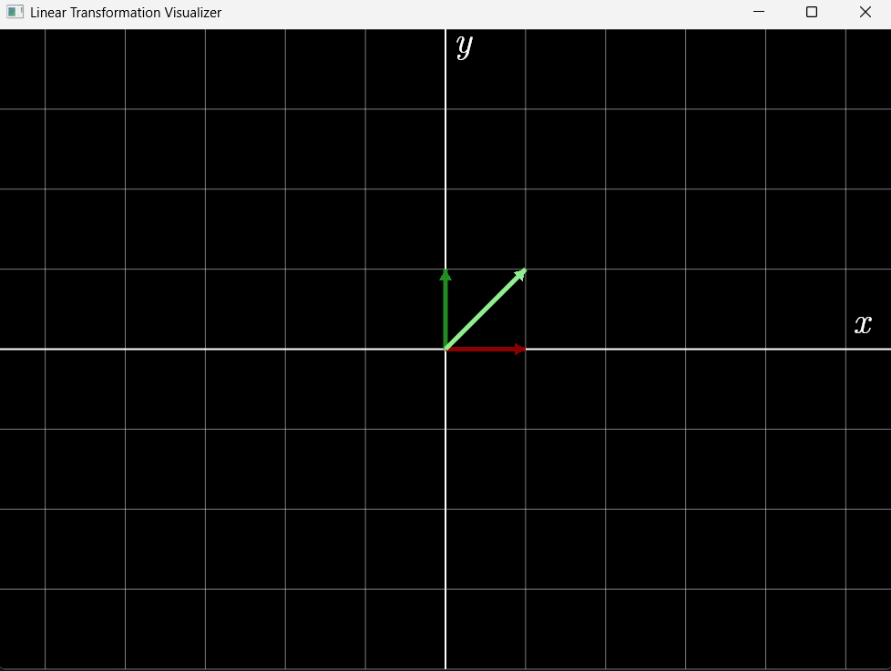
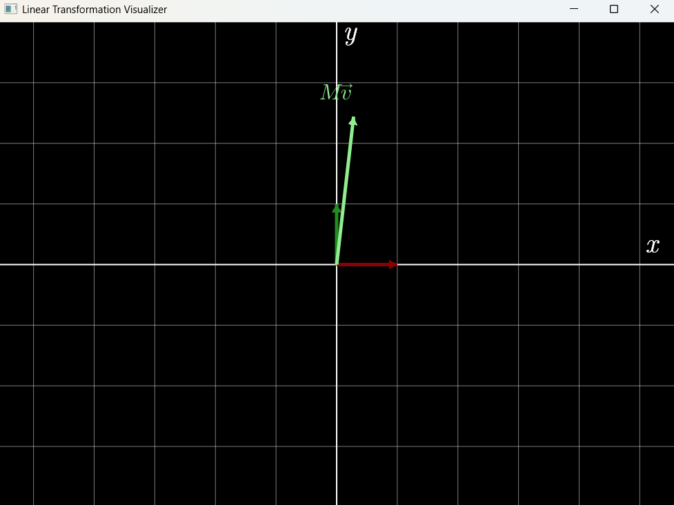
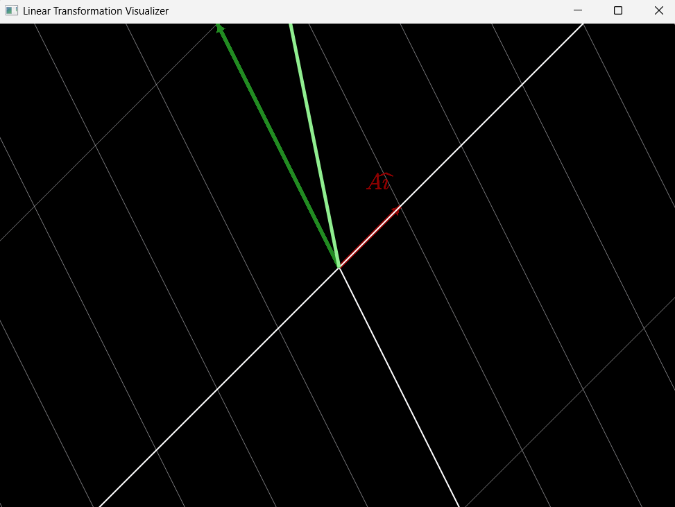

# Linear Transformation Visualizer

A real-time 2D linear algebra visualization engine written in C# using - [SkiaSharp](https://github.com/mono/SkiaSharp) and [CSharpMath](https://github.com/verybadcat/CSharpMath) for LaTeX rendering.

This project focuses on visualizing how matrices transform vectors and entire coordinate spaces through interactive rendering and animation.

Inspired by the geometric intuition and visual explanations from [3Blue1Brown](https://www.youtube.com/@3blue1brown) and the [*Essence of Linear Algebra*](https://www.youtube.com/playlist?list=PLZHQObOWTQDPD3MizzM2xVFitgF8hE_ab) series.

---

# Features

## Current Features

- Real-time vector rendering
- Coordinate grid rendering
- Standard basis visualization
- Animated vector transformations
- Animated space transformations
- Basis notation rendering (`î`, `ĵ`)
- LaTeX mathematical text rendering
- Keyboard-driven interaction system
- Custom world-to-screen rendering pipeline

---

# Matrix Transformation

Pressing `T` applies the matrix transformation

$$
A =
\begin{bmatrix}
1 & -2 \\
1 & 4
\end{bmatrix}
$$

to the currently rendered vector.

## The transformation is animated using interpolation:

$$\mathbf{v}(t)=(1-t)\mathbf{v}_{start}+t\mathbf{v}_{end}$$

allowing smooth transitions between vector states.

---

# Space Transformation

Pressing `S` transforms the entire coordinate system using:

$$
T(\mathbf{v}) = A\mathbf{v}
$$

This allows direct visualization of how linear transformations deform space itself.

---

# Controls

| Key | Action |
|---|---|
| `T` | Transform vector |
| `S` | Transform entire space |
| `D` | Toggle basis vector notation |

---

# Screenshots

## Initial Coordinate System



---

## Vector Transformation



---

## Space Transformation



---

# Technologies Used

- C#
- WPF
- [SkiaSharp](https://github.com/mono/SkiaSharp)
- [CSharpMath](https://github.com/verybadcat/CSharpMath)

---

# Rendering Architecture

The project currently implements:

- Custom coordinate system
- World-to-screen transformation
- Real-time rendering loop
- Grid rendering system
- Vector rendering with arrowheads
- Animated interpolation system
- Basis visualization
- Mathematical text rendering

---

# Future Goals

## Mathematical Features

- Eigenvector visualization
- Eigenvalue visualization
- Determinant visualization
- Basis transformation visualization
- Matrix multiplication composition
- Multiple vector support

---

## Interactive Features

- Interactive GUI
- Matrix editor
- Vector editor
- Zooming and panning
- Mouse interaction
- Real-time transformation editing

---

## Visual Improvements

- Improved animations
- Dynamic labeling system
- Better mathematical typography
- Transformation trails
- 3Blue1Brown-inspired rendering style

---

# Example Transformations

## Rotation Matrix

$$
R(\theta)=
\begin{bmatrix}
\cos\theta & -\sin\theta \\
\sin\theta & \cos\theta
\end{bmatrix}
$$

---

## Shear Matrix

$$
S=
\begin{bmatrix}
1 & k \\
0 & 1
\end{bmatrix}
$$

---

## Scaling Matrix

$$
D=
\begin{bmatrix}
a & 0 \\
0 & b
\end{bmatrix}
$$

---

# Project Philosophy

The goal of this project is not only to visualize linear algebra, but also to deeply understand:

- coordinate systems
- rendering pipelines
- graphics programming
- matrix transformations
- mathematical visualization

All rendering and mathematical logic are implemented manually to better understand how mathematical visualization systems work internally.

---

# Build

```bash
dotnet build
dotnet run
```

---

# Inspiration

- [3Blue1Brown](https://www.youtube.com/@3blue1brown)
- [*Essence of Linear Algebra*](https://www.youtube.com/playlist?list=PLZHQObOWTQDPD3MizzM2xVFitgF8hE_ab)
- Interactive mathematical visualization systems

---

# License

MIT License
